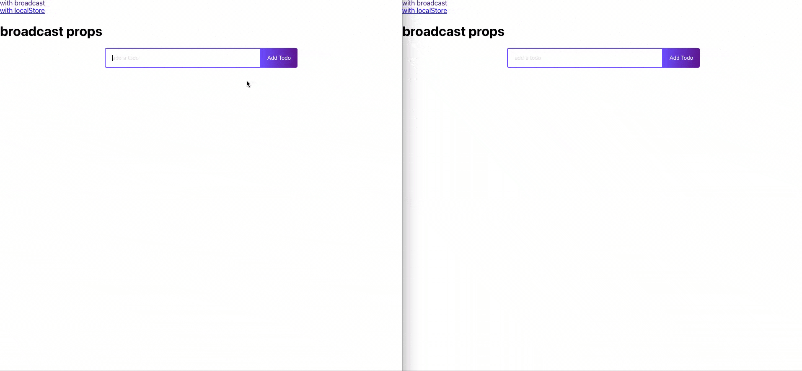

[](https://codecov.io/gh/josermarinr/hook-cross-tab)


# hook cros tab

## Motivation

This hook helps to share the status among many tabs, it is multipurpose,
the motivation for making this type of hook is because we entered a new era
when having a lot of screens on your workstation is normal at this time and we need to adapt to that.

Constantly configuring hooks to save and share states, the idea of hook-cross-tab comes out, enabled to work with only 3 properties

## To use

call the hook inside the function and you need pass three props,

first the key of your data, this will be the name of the data to be stored

second data, this hook accepts any data type

third the option, it only accepts "local" for localstorage and "broadcast"

example
```
  const [todos, setTodos] = useCrossTabState({
        key: "tareas",
        initialState: [],
        option: "local
    })
```

i invite you to see the real implementation in
[this repo](https://github.com/josermarinr/example-hook-cross-tab)

***by J. MARIN :anchor:***
